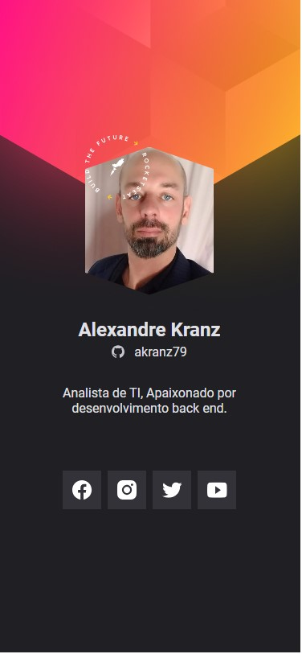

#### Criação de um crachá virtual

Este crachá conta com um design interessante e contemporâneo, uma foto e descrição da pessoa e pode ser configurado com links para redes sociais.
Totalmente desenvolvido em HTML, CSS e Javascript.
Semana NLW RocketSeat 🚀

Abaixo, uma amostra de como fica o crachá depois de concluído:

---
 

 

⚙ O desenvolvimento de software é uma arte em constante evolução - nunca se contente com o suficiente. ⚙
